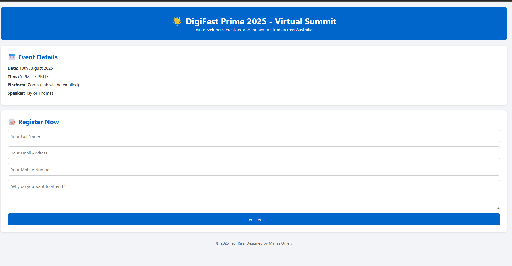

# DigiFest Event Registration System

## 📌 Project Overview

The **DigiFest Event Registration System** is a web-based registration platform that allows users to register for an online tech event.

Users can submit their details through a form, and the data is sent to a backend server where it is processed and confirmation details are sent via email.

This project demonstrates the integration of **frontend form handling with a backend API**.

---

## 🚀 Features

* Event information display
* User registration form
* Form validation
* API integration using JavaScript `fetch()`
* Data submission to backend server
* Email confirmation system
* Thank-you page after successful registration

---

## 🛠 Technologies Used

### Frontend

* HTML5
* CSS3
* JavaScript

### Backend

* Node.js
* Express.js

### Database

* MongoDB Atlas

### Deployment

* Render (Backend Hosting)

---

## 📂 Project Structure

```
Event_Registration_Page_Frontend
│
├── index.html
├── thankyou.html
│
├── css
│   ├── index.css
│   └── thankyou.css
│
├── js
│   └── script.js
│
└── README.md
```

---

## ⚙️ How It Works

1. User fills out the registration form.
2. JavaScript collects the form data.
3. Data is sent to the backend API using `fetch()`.
4. Backend processes the request and stores the data.
5. A confirmation email is sent to the user.
6. User is redirected to the **Thank You page**.

---

## 🌐 API Endpoint

```
POST /register
```

Example request body:

```json
{
  "name": "John Doe",
  "email": "john@example.com",
  "phone": "9876543210",
  "message": "Interested in the event"
}
```
---

## 📸 Screenshots

### 🔹 Registration Page


### 🔹 Thank You Page


---

## ✨ Future Improvements

* Admin dashboard to view registrations
* Event seat limit
* Payment integration
* Email verification system
* User login system
